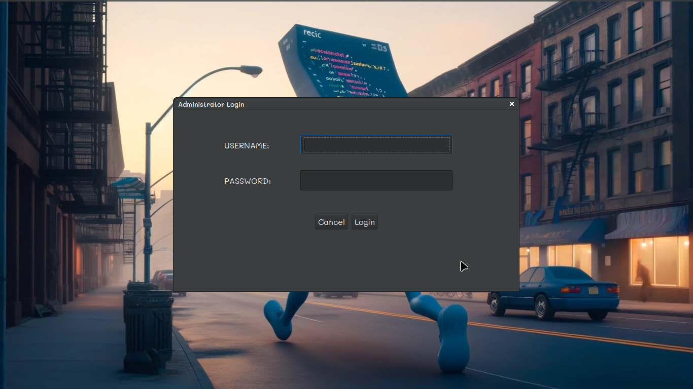
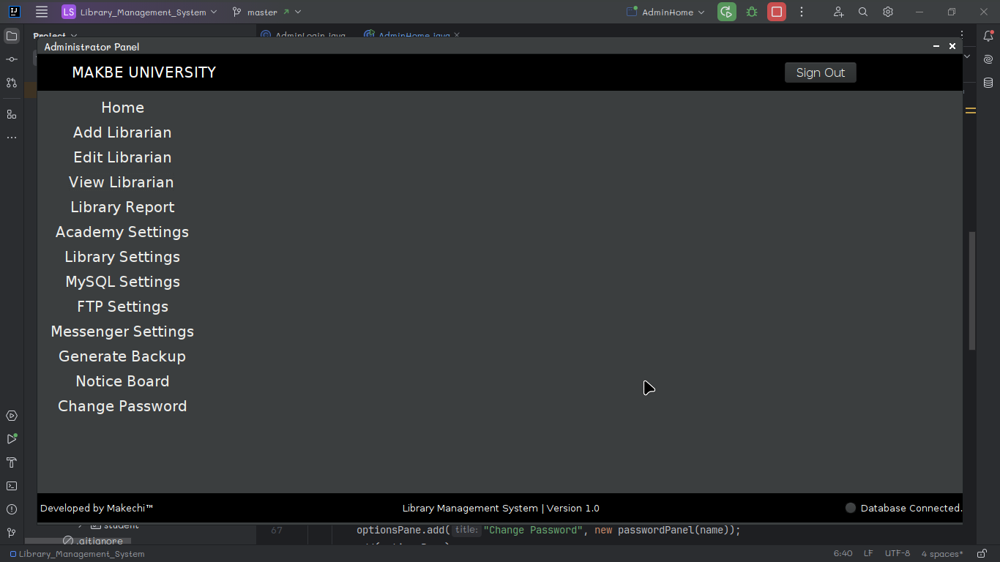

# Library Management System

This is a Java Swing-based library management system that utilizes MySQL for the database management.

## Overview

This library management system provides a user-friendly interface for librarians to manage their library resources efficiently. It allows librarians to perform tasks such as adding, updating, and deleting books, managing borrower information, and handling book transactions.

## Features

- **Book Management**: Add, update, and delete books from the library database.
- **Borrower Management**: Manage borrower information including adding new borrowers, updating their details, and removing them from the system.
- **Transaction Management**: Handle book transactions including borrowing and returning books.
- **Search Functionality**: Search for books and borrowers based on various criteria such as title, author, ISBN, borrower ID, etc.
- **User-friendly Interface**: The system is designed with a simple and intuitive interface using Java Swing for ease of use.

## Screenshots






## Requirements

- Java Development Kit (JDK)
- MySQL database server
- MySQL Connector/J (JDBC driver for MySQL)

## Installation

1. Clone the repository:
    ```bash
    git clone https://github.com/Makechi02/library-management-system.git
    ```

2. Set up the MySQL database:
    - Create a new database named `library_management_system`.
    - Import the provided SQL file (`library.sql`) into the `library_management_system` database.

3. Open the project in your Java IDE (e.g., IntelliJ IDEA, Eclipse).

4. Configure the MySQL database connection:
    - Create a file named `database.properties` in the root folder of the project.
    - Add the database name, username and password as shown below:
    ```
   db.name=library_management_system
   db.username=your_username
   db.password=your_password
      ```
5. Build and run the project.

## Usage

1. Launch the application.
2. Log in using `admin` as username and `admin` as the password for the admin account.
3. Use the various features provided by the library management system to manage books, borrowers, and transactions.

## Contributors

- [Makechi Eric](https://github.com/Makechi02)
